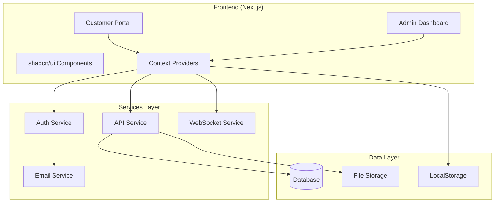

# Architecture Documentation

## System Overview

IncoXchange is a modern invoice factoring platform built with a microservices-ready architecture. The application consists of two main modules: Customer Portal and Admin Dashboard, both sharing common services and components.



## Technology Stack

### Core Technologies

| Layer | Technology | Purpose |
|-------|------------|---------|
| **Framework** | Next.js 16 (App Router) | Server-side rendering, routing, API routes |
| **UI Library** | React 19 | Component-based UI |
| **Language** | TypeScript 5 | Type safety and developer experience |
| **Styling** | Tailwind CSS 3 | Utility-first CSS framework |
| **Components** | shadcn/ui + Radix UI | Accessible, customizable components |
| **State Management** | React Context API | Global state management |
| **Data Fetching** | Native fetch + SWR patterns | API communication |
| **Charts** | Recharts | Data visualization |
| **Icons** | Lucide React | Consistent icon system |
| **Notifications** | Sonner | Toast notifications |

### Supporting Libraries

| Library | Purpose |
|---------|---------|
| **jsPDF** | PDF generation for reports |
| **xlsx** | Excel file generation |
| **html2canvas** | Screenshot capture for export |
| **tailwindcss-animate** | Animation utilities |

## Application Architecture

### 1. Routing Structure

```
/                           # Redirects to /signup
├── /signin                 # Sign in with magic link
├── /signup                 # Sign up flow
│   └── /verify            # Email verification
├── /onboarding            # 7-step onboarding process
├── /dashboard             # Customer dashboard
└── /admin                 # Admin section
    ├── /login             # Admin login
    ├── /dashboard         # Application management
    ├── /analytics         # Analytics dashboard
    ├── /audit             # Audit logs
    ├── /users             # User management
    └── /demo              # Demo mode (auto-login)
```

### 2. Component Architecture

```
components/
├── ui/                    # Base UI components (shadcn/ui)
│   ├── button.tsx
│   ├── input.tsx
│   ├── card.tsx
│   └── ...
├── dashboard/             # Dashboard-specific components
│   ├── ApplicationStatus.tsx
│   └── ApplicationPreview.tsx
└── onboarding/           # Onboarding flow components
    ├── OnboardingLayout.tsx
    ├── WelcomeStep.tsx
    ├── BusinessProfileStep.tsx
    ├── CustomersStep.tsx
    ├── BankConnectStep.tsx
    ├── InvoicesStep.tsx
    ├── ReviewStep.tsx
    └── FactoringAgreementStep.tsx
```

### 3. State Management

#### UserContext
Manages customer portal state including:
- Authentication status
- User profile data
- Onboarding progress
- Application data
- Credit terms
- Timeline tracking

```typescript
interface UserContextType {
  // Authentication
  isAuthenticated: boolean;
  userEmail: string;
  
  // Profile
  userProfile: UserProfile;
  
  // Onboarding
  onboardingData: OnboardingData;
  currentStep: number;
  completedSteps: number[];
  
  // Application
  applicationStatus: ApplicationStatus;
  creditTerms: CreditTerms;
  
  // Timeline
  startedAt: Date;
  submittedAt: Date;
  approvedAt: Date;
  rejectedAt: Date;
  
  // Actions
  signIn: (email: string) => void;
  signOut: () => void;
  saveOnboardingData: (data: Partial<OnboardingData>) => void;
  submitApplication: () => void;
}
```

#### AdminAuthContext
Manages admin authentication and permissions:

```typescript
interface AdminAuthContextType {
  adminUser: AdminUser | null;
  isAdminAuthenticated: boolean;
  isLoading: boolean;
  signIn: (email: string, password: string) => Promise<void>;
  signOut: () => void;
}
```

### 4. Service Layer

#### API Service (`lib/api.ts`)
- Centralized API communication
- Mock implementations for demo
- Ready for backend integration
- Error handling and retry logic

#### Audit Service (`lib/auditLog.ts`)
- Tracks all admin actions
- Persistent storage
- Filterable logs
- Compliance ready

#### Comments Service (`lib/comments.ts`)
- Application notes system
- Internal communication
- Thread management
- Edit/delete capabilities

#### Notification Service (`lib/notifications.ts`)
- Email template management
- Queue system
- User preferences
- Delivery tracking

#### WebSocket Service (`lib/websocket.ts`)
- Real-time updates
- Connection management
- Event subscription
- Auto-reconnection

#### Demo Data Service (`lib/demoData.ts`)
- Test data generation
- Scenario loading
- Data persistence
- Auto-expiry (24h)

### 5. Data Flow

#### Customer Onboarding Flow
```
1. User signs up → Magic link sent
2. Email verified → Redirect to onboarding
3. Complete 7 steps → Data saved to context
4. Submit application → Status: under_review
5. Admin reviews → Approve/Reject
6. User notified → Access dashboard
```

#### Admin Review Flow
```
1. Admin logs in → Load applications
2. Select application → View details/documents
3. Add comments → Internal notes
4. Make decision → Approve/Reject
5. Update logged → Audit trail
6. Notification sent → Customer informed
```

## Security Architecture

### Authentication
- **Customer Portal**: Magic link authentication
- **Admin Dashboard**: Username/password with session
- **Token Storage**: HttpOnly cookies (production)
- **Session Management**: 24h expiry with refresh

### Authorization
- Role-based access control (RBAC)
- Admin roles: `admin`, `reviewer`, `viewer`
- Permission matrix for operations
- API-level authorization checks

### Data Protection
- All forms validate client and server-side
- XSS protection via React's default escaping
- CSRF tokens for state-changing operations
- Input sanitization for file uploads

## Performance Optimizations

### Code Splitting
- Route-based code splitting
- Dynamic imports for heavy components
- Lazy loading for charts and exports

### Caching Strategy
- Static assets cached (1 year)
- API responses cached (SWR pattern)
- LocalStorage for offline capability
- Service worker ready architecture

### Rendering Strategy
- Static generation for marketing pages
- Server-side rendering for dynamic content
- Client-side rendering for interactive features
- Incremental Static Regeneration (ISR) ready

## Scalability Considerations

### Horizontal Scaling
- Stateless application design
- Session storage in Redis (production)
- Load balancer ready
- CDN for static assets

### Database Strategy
- Read replicas for reporting
- Connection pooling
- Indexed queries
- Pagination for large datasets

### File Storage
- Cloud storage integration (S3/GCS)
- Direct upload capability
- CDN for document serving
- Virus scanning pipeline

## Deployment Architecture

### Development
```
Local Development
├── Next.js Dev Server (Port 3000)
├── Mock API Services
├── LocalStorage for data
└── Hot Module Replacement
```

### Production
```
Production Environment
├── Next.js on Vercel/AWS/GCP
├── PostgreSQL Database
├── Redis for sessions
├── S3/CloudStorage for files
├── CloudFront/Fastly CDN
├── SendGrid/SES for email
└── CloudWatch/DataDog monitoring
```

## Integration Points

### Required External Services

1. **Email Service**
   - SendGrid or AWS SES
   - Templates for magic links, notifications
   - Delivery tracking

2. **Payment Processing**
   - Stripe/PayPal integration ready
   - Webhook handling
   - Invoice management

3. **Banking Integration**
   - Plaid for account verification
   - Transaction history
   - Balance checks

4. **Document Processing**
   - OCR for invoice scanning
   - PDF generation
   - Document verification

5. **Analytics**
   - Google Analytics 4
   - Custom event tracking
   - Conversion funnel monitoring

## Error Handling Strategy

### Client-Side
- Error boundaries for component failures
- Fallback UI for loading states
- Toast notifications for user feedback
- Retry logic for failed requests

### Server-Side
- Centralized error handling
- Structured logging
- Error tracking (Sentry)
- Graceful degradation

## Testing Strategy

### Unit Testing
- Component testing with React Testing Library
- Service layer testing with Jest
- Utility function testing
- Context provider testing

### Integration Testing
- API endpoint testing
- Database query testing
- File upload testing
- Email sending testing

### E2E Testing
- Onboarding flow testing
- Admin workflow testing
- Cross-browser testing
- Mobile responsiveness testing

## Monitoring & Observability

### Application Monitoring
- Performance metrics (Core Web Vitals)
- Error tracking and alerts
- User session recording
- API response times

### Business Metrics
- Application completion rate
- Approval/rejection ratio
- Time to decision
- User engagement metrics

### Infrastructure Monitoring
- Server health checks
- Database performance
- File storage usage
- CDN hit rates

## Future Architecture Considerations

### Microservices Migration
- Extract auth service
- Separate admin dashboard
- Independent notification service
- Document processing service

### Event-Driven Architecture
- Event sourcing for audit
- CQRS for reporting
- Message queue integration
- Webhook management

### Multi-Tenancy
- Organization-level isolation
- Custom branding per tenant
- Separate data stores
- Role-based permissions

### API Gateway
- Rate limiting
- API versioning
- Request routing
- Authentication proxy

## Development Workflow

### Git Workflow
```
main
├── develop
│   ├── feature/onboarding-improvements
│   ├── feature/admin-dashboard
│   └── feature/api-integration
├── staging
└── production
```

### CI/CD Pipeline
1. Code pushed to feature branch
2. Automated tests run
3. Build verification
4. Merge to develop
5. Deploy to staging
6. QA verification
7. Merge to main
8. Deploy to production

### Environment Management
- **Local**: Development with mock data
- **Staging**: Production-like with test data
- **Production**: Live environment

## Database Schema (Proposed)

```sql
-- Users table
users (
  id UUID PRIMARY KEY,
  email VARCHAR UNIQUE,
  created_at TIMESTAMP,
  last_login TIMESTAMP
)

-- Applications table
applications (
  id UUID PRIMARY KEY,
  user_id UUID REFERENCES users,
  status VARCHAR,
  business_data JSONB,
  submitted_at TIMESTAMP,
  decided_at TIMESTAMP,
  decision_by UUID REFERENCES admin_users
)

-- Documents table
documents (
  id UUID PRIMARY KEY,
  application_id UUID REFERENCES applications,
  type VARCHAR,
  file_url VARCHAR,
  uploaded_at TIMESTAMP,
  verified BOOLEAN
)

-- Admin users table
admin_users (
  id UUID PRIMARY KEY,
  email VARCHAR UNIQUE,
  role VARCHAR,
  permissions JSONB
)

-- Audit logs table
audit_logs (
  id UUID PRIMARY KEY,
  user_id UUID,
  action VARCHAR,
  target_type VARCHAR,
  target_id UUID,
  details JSONB,
  created_at TIMESTAMP
)
```

## API Design Principles

### RESTful Conventions
- GET for reading data
- POST for creating resources
- PUT/PATCH for updates
- DELETE for removal

### Response Format
```json
{
  "success": true,
  "data": {},
  "message": "Operation successful",
  "timestamp": "2025-01-01T00:00:00Z"
}
```

### Error Format
```json
{
  "success": false,
  "error": {
    "code": "VALIDATION_ERROR",
    "message": "Invalid input",
    "details": {}
  },
  "timestamp": "2025-01-01T00:00:00Z"
}
```

### Pagination
```json
{
  "data": [],
  "pagination": {
    "page": 1,
    "pageSize": 20,
    "total": 100,
    "hasMore": true
  }
}
```

---

**Last Updated**: December 2025  
**Version**: 1.0.0
